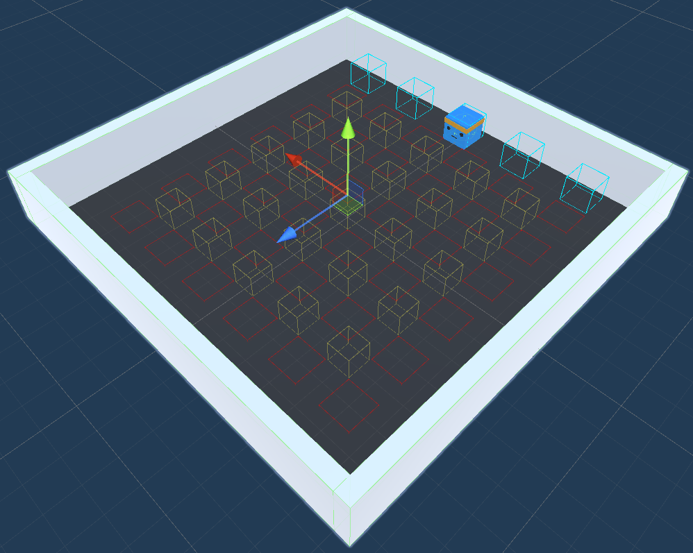

# Лабораторная 2. Кнопки и коробки

Обучите агентов нажимать на кнопки.

В заготовке реализована логика расстановки на уровне заданного количества кнопок, коробок и агентов и управление агентом. Логика расстановки предметов и детектирования окончания уровня вынесена в `GameEnvController`.

При нажатии *одновременно* на все кнопки на уровне открывается дверь. Уровень считается пройденным, если открыли дверь (эквивалентно нажатию на все кнопки) или если агент прошёл через дверь, в зависимости от варианта.

## Задание
[Настройки обучения](https://unity-technologies.github.io/ml-agents/Training-Configuration-File/) и сенсоры (например, GridSensor или RayPerceptionSensor) необходимо подобрать самостоятельно (при затруднениях, помимо документации можно посмотреть на стандартные примеры).

Можно использовать любые методы из фреймворка (в том числе обучение на примерах и по учебному плану, PPO, SAC, MO-POCA) и модифицировать код компонентов заготовки.

Базовое задание: [5 баллов] Есть хотя бы одна кнопка и хотя бы один агент обучен на неё нажимать.

### Варианты

N - количество кнопок, должно быть не менее двух.

1. [+10 баллов] N кнопок, K коробок, один агент.
3. [+10 баллов] N кнопок, M агентов, $N = M$.
4. [+15 баллов] N кнопок, K коробок, M агентов, $N > M$.

Модификаторы:
1. [+1-5 баллов] +1 балл за каждые две дополнительные кнопки (4 кнопки +1 балл, 6 кнопок + 2 балла и т.д., до 5 баллов за 12 кнопок).
1. [+5 баллов] Если после нажатия кнопок уровень не заканчивается, а открывается дверь, через которую нужно пройти одному из агентов.
2. [+5 баллов] Если в задании с коробками всё работает при $K < N$.
3. [+5 баллов] За добавление другого варианта активатора помимо кнопки (например, активация лазером).
4. [+3 баллов] За добавление препятствий.
5. [+5 баллов] N, M, K меняются динамически и с этим справляется одна модель.
6. [+2 балла] Настройки количества предметов вынесены в yaml с конфигурацией сети (штатными средствами фреймворка).